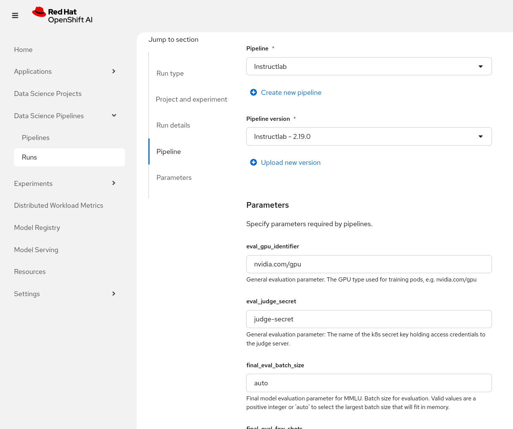

# InstructLab on Red Hat OpenShift AI

This repo is the central location for the code, Container files and yamls needed to deploy [Instructlab] onto an [OpenShift] cluster with [Red Hat OpenShift AI (RHOAI)]. This project leverages a number of the tools included with RHOAI working together to run InstructLab. Specifically, Data Science Pipelines for application orchestration, Kserve Serving for model serving, and the Distributed Training Operator to run our model training across multiple GPU enabled nodes.

<p align="center"></p>

## Getting Started

This project makes running the InstructLab large language model (LLM) fine-tuning process easy and flexible on OpenShift. However, before getting started there are a few prerequisites and additional setup steps that need to be completed.

## Requirements

* An OpenShift cluster with:
  * GPUs for training (additional requirements for serving the Teacher and Judge models are documented below):
    * At a minimum, a node with at least 4 GPUs such as an NVIDIA A100s
    * This is not including GPUs required to deploy and run Judge & Teacher models (see below)
  * The following Operators already installed:
    * Red Hat Authorino
    * Red Hat OpenShift Serverless
    * Red Hat OpenShift Service Mesh v2
      * NOTE: v3 is not compatible with RHOAI
* [SDG taxonomy tree] to utilize for Synthetic Data Generation (SDG)
* An OpenShift AI 2.19 or newer installation, with:
  * Training Operator, ModelRegistry, KServe, and Data Science Pipelines components installed via the DataScienceCluster
    * See docs on [Installing RHOAI components via DSC]
  * For [Model Registry] you will need:
    * Model Registry API URL
    * Model Registry Name
  * A data science project/namespace, in this document this will be referred to as `<data-science-project-name/namespace>`
    * The Data Science Project should have a [Data Science Pipelines Server Configured]
  * A GPU [Accelerator profile enabled and created]
    * NOTE: Install NVIDIA GPU Operator 24.6
        * This is due to a [known issue with CUDA Driver] versions mismatch, you can only use this Operator version.
* A [StorageClass] that supports dynamic provisioning with [ReadWriteMany] access mode.
  * You can deploy your own using [nfs storage] for non production use cases
* Have the location for the [base model configured] (i.e. S3 or OCI)
* A locally installed [oc] command line tool to create and manage kubernetes resources.
* [Teacher and Judge models] being served with their access credentials stored as k8s secrets in `<data-science-project-name/namespace>`
* An OCI registry to push the output model to along with credentials with push access

#### Disconnected Cluster Requirements

Follow the [disconnected setup instructions] for setting up your disconnected environment.

## Enable the pipeline

The InstructLab pipeline is automatically provisioned and managed by the DataSciencePipelinesApplication (DSPA) resource. This management is disabled by default in RHOAI 2.19, but you may enable it by patching the following field in the DSPA:

```bash
DS_PROJECT="<data-science-project-name/namespace>"
DSPA_NAME="dspa" # RHOAI Default name for DSPA
oc patch dspa ${DSPA_NAME} -n ${DS_PROJECT} --type=merge --patch='{"spec": { "apiServer": { "managedPipelines": { "instructLab": {"state": "Managed"}}}}}'
```

After a few seconds, the InstructLab pipeline will be automatically added to the pipeline server, and it will be available in RHOAI Dashboard.

## Output OCI Registry

As a result of running the InstructLab pipeline, a fine-tuned model will be generated. The pipeline can push the resulting model to a OCI container registry (e.g. quay.io) if the credentials are provided. To do this, in your data science project namespace, deploy your OCI output registry secret:

```yaml
# oci_output_push_secret.yaml
apiVersion: v1
kind: Secret
metadata:
  name: <oci-registry-push-secret>
stringData:
  .dockerconfigjson: {...}
type: kubernetes.io/dockerconfigjson
```

Deploy it in your DS project:

```bash
oc -n <data-science-project-name/namespace> oc apply -f oci_output_push_secret.yaml
```

Note the `metadata.name` of this secret, you will need this when filling out the InstructLab pipeline parameters.

## Taxonomy Repo

As per the [SDG taxonomy tree] documentation, you should have a taxonomy git repo ready. When running the pipeline in the following step, you will be prompted for an optional `sdg_repo_secret` parameter.

This is useful if your taxonomy repo is private. In such a case you can provide a kubernetes `Secret` of type either [basic-auth] or [ssh-auth]. Follow these instructions to create your secret.
If using `basic-auth`, provide your Git access token as the `password`. It is required that these credentials are applicable to not only the parent taxonomy repo, but also any nested repo provided within
each individual qna file.

By default the secret name `taxonomy-repo-secret` is used, or you can opt to provide another secret under the `sdg_repo_secret` field.


## Run the Pipeline

Now that all the cluster requirements have been set up, we are ready to upload and run our InstructLab pipeline!

Starting the InstructLab pipeline run is the same as starting any other run using Data Science Pipelines.

The instructions for how to create a typical run can be found [here][DSP Run Docs]. For the pipeline selection step, you will be able to select the `InstructLab` pipeline from the pipeline list when creating a run.

You can find a description of each Parameter once you go to the run creation page. Some parameters already have defaults, while others do not, and some are optional. Please carefully read the description of each to better customize the pipeline to meet your needs.

> [!CAUTION]
> There is a [bug] in RHOAI 2.19 where empty parameters do not appear when duplicating a run, so during your testing you might have to create a new pipeline runs instead of duplicating them.

<p align="center"></p>

## Troubleshooting

For a troubleshooting guide see [here][troubleshooting].

[StorageClass]: https://kubernetes.io/docs/concepts/storage/storage-classes/
[SDG taxonomy tree]: https://docs.redhat.com/en/documentation/red_hat_enterprise_linux_ai/latest/html/creating_skills_and_knowledge_yaml_files/customize_taxonomy_tree
[ReadWriteMany]: https://kubernetes.io/docs/concepts/storage/persistent-volumes/#access-modes
[Instructlab]: https://instructlab.ai/
[OpenShift]: https://www.redhat.com/en/technologies/cloud-computing/openshift
[Red Hat OpenShift AI (RHOAI)]: https://www.redhat.com/en/technologies/cloud-computing/openshift/openshift-ai
[Installing RHOAI components via DSC]: https://docs.redhat.com/en/documentation/red_hat_openshift_ai_self-managed/latest/html/installing_and_uninstalling_openshift_ai_self-managed/installing-and-deploying-openshift-ai_install#installing-openshift-ai-components-using-cli_component-install
[Data Science Pipelines Server Configured]: https://docs.redhat.com/en/documentation/red_hat_openshift_ai_self-managed/latest/html/working_with_data_science_pipelines/managing-data-science-pipelines_ds-pipelines#configuring-a-pipeline-server_ds-pipelines
[known issue with CUDA Driver]: https://issues.redhat.com/browse/RHOAIENG-19869
[Accelerator profile enabled and created]: https://docs.redhat.com/en/documentation/red_hat_openshift_ai_self-managed/2.18/html/managing_openshift_ai/enabling_accelerators#enabling-nvidia-gpus_managing-rhoai
[base model configured]: docs/base_model.md
[Teacher and Judge models]: manifests/README.md#deploying-teacher-and-judge-models
[DSP Run Docs]: https://docs.redhat.com/en/documentation/red_hat_openshift_ai_self-managed/latest/html/working_with_data_science_pipelines/managing-pipeline-runs_ds-pipelines#executing-a-pipeline-run_ds-pipelines
[oc]: https://docs.redhat.com/en/documentation/openshift_container_platform/latest/html/cli_tools/openshift-cli-oc#cli-about-cli_cli-developer-commands
[Model Registry]: https://docs.redhat.com/en/documentation/red_hat_openshift_ai_self-managed/2.18/html/managing_model_registries/creating-a-model-registry_managing-model-registries
[disconnected setup instructions]: ./docs/disconnected_setup.md
[nfs storage]: ./manifests/nfs_storage/nfs_storage.md
[troubleshooting]: ./docs/troubleshooting.md
[bug]: https://issues.redhat.com/browse/RHOAIENG-22522
[basic-auth] : https://kubernetes.io/docs/concepts/configuration/secret/#basic-authentication-secret
[ssh-auth]: https://kubernetes.io/docs/concepts/configuration/secret/#ssh-authentication-secrets
